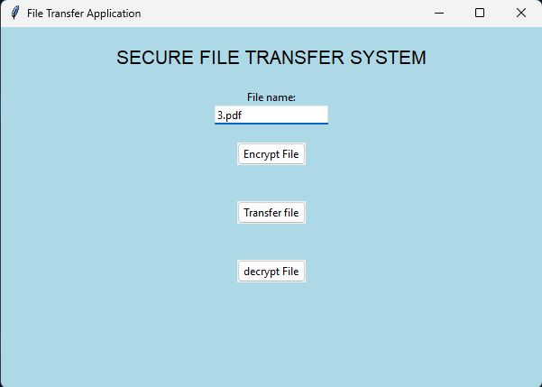
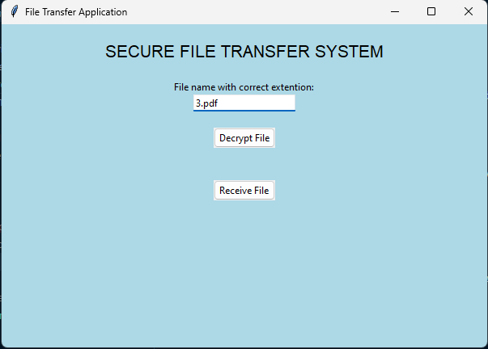

# SECURE FILE TRANSFER SYSTEM

## Setup

Open Terminal

```bash
git clone https://github.com/NM-004/Secure-File-Transfer-System.git
```

then

```bash
cd Secure-File-Transfer-System
```

Open vscode here or run python in terminal

### Install all the necessory modules

In terminal download all the required python modules

```bash
pip install cryptography
```

```bash
pip install tk
```

```bash
pip install sockets
```

### Working

First run key.py to generate private key to use it for encrypting and decrypting the file.

```bash
python key.py
```

<p>then send this private_key.txt via server.py to client.py</p>
<p>Then run server.py to start a server.</p>

```bash
python server.py
```

<p> Then enter the key file to send it to the client, dont encrypt it, I repeat don't  encrypt it. just plain old key file, then click on transfer button.</p>
 
<p> Change the host name from localhost to the server ip and then run the client server </p>

```bash
python client.py
```

<p>In client gui enter the name of the key file as private_key.txt and click on recieve button. after you receive a the private key you can send any file and encrypt it before sending.</p>

## ScreenShots:
**Server**



**Client**

